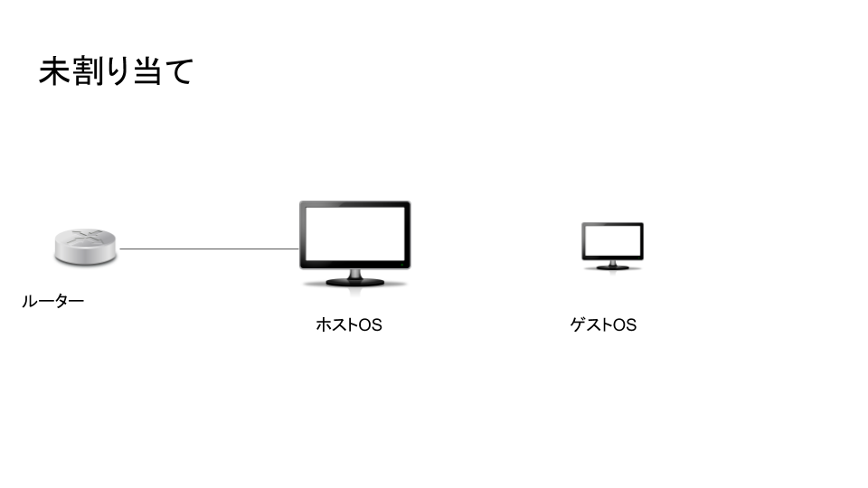
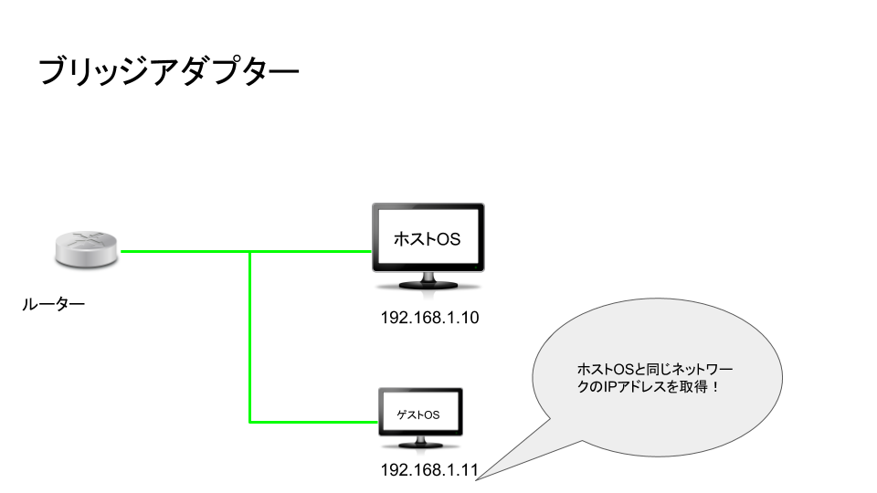

# 仮想環境を構築する

## viartual box を入れる

- viarualboxは仮想化をするためのツール
- インストールは公式サイトからした

## CentOSのイメージをダウンロードする

参考サイト

- "https://applica.info/virtualbox-centos"
  
1. 公式サイトからcentOSのイメージを取得する.
    - isoファイルを入れた
    - isoとはディスク一枚の内容を丸ごと一つのファイルに記録したもの
    - すなわち、ディスクの先頭から末尾まで完全に読み取っているのでディレクトリ構造も完全に記録されている
    - なのでHDに保存されたISOを仮想ドライブソフトでマウントすると仮想ドライブにそのデータが読み込まれてディスク挿入時のような間隔でファイルの読み書きができる
    - iosファイル結構重い.....
  
2. イメージを用いてvirtualbox上にvmを作成
   - 基本的に設定の通りにやっている
   - C:\Users\syouta\VirtualBox VMs\CentOS7　にVMを作成
   - トラブった(´;ω;｀)
     - Failed to get device handle and/or partition ID for 00000000013a36f0 (hPartitionDevice=0000000000000da5, Last=0xc0000002/1) (VERR_NEM_VM_CREATE_FAILED).
     - windowsの設定で仮想マシンがらみがおかしいかも？
     - windowsの設定でいkのチェックボックスを外したところ無事に動いた
  
- 8/3追記
  - 仮想HDDを可変にしていたがそしたらcentOS画用量足りなくてインストールできんかったので固定にした。

## 肝になってくるのはネットワーク設定

1. 何もしないと繋がらない。

重要な点

- ゲストOSに対してNATが設定されている
- すなわちデフォルトではゲストOSからは外部ネットワークにアクセスできるが、外部からは受け付けていない
- よって、ポートフォワーディングでホストOSと紐づけることで外部からのアクセスを可能にする　とかの工夫が必要。
(別途FW等の設定が必要)
- ブリッジアダプターせつぞくがいちばんわあかりやすいかなぁ。

- ほかにも様々な接続形態がある
参考サイト様

- "https://www.it-poem.com/?p=310"

## 追記

- クリップボードを有効化するときにエラーができた。
  >failto load SELinux policy freezing

　－－　SELINUX を無効にしたら、無事に起動できた。
