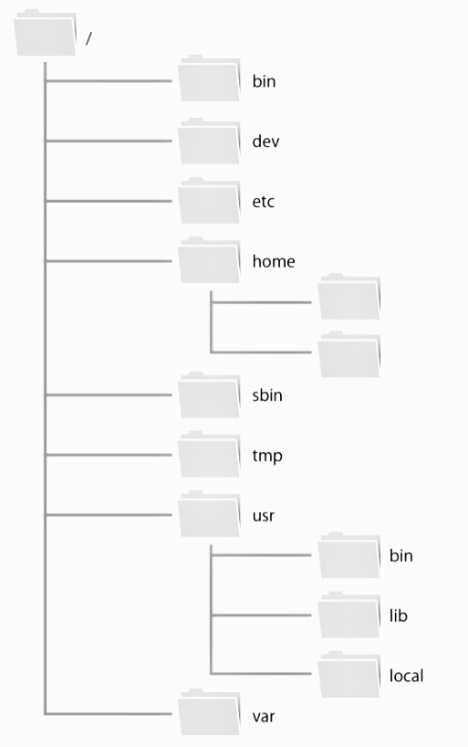

# Linux(CentOS) の基本コマンドをまとめる

## 用語の確認

- shell
  - Linuxのkernelとコマンドを繋ぐインターフェース
  - コマンドの実態はファイルである
  - 入力されたコマンドを検索する(この時に探す場所がPATH)
  - ログイン時に立ち上がるシェルは/bin/bash でこれもコマンド
  - シェルの上でシェルを起動するのは重ねるイメージ
  - あくまでターミナルの上でシェルが動いているだけで別物

- ファイル権限
  - ファイル変幻をまとめて管理したいときにユーザをグループに追加してグループに権限を付与する
  - 注意
    - ディレクトリの内のファイルの削除権限はディレクトリの権限で決まるのでファイルがreadオンリーだったとしても消せちゃうのだ。

- linuxのディレクトリ構造

- 詳細はテキスト確認

- ln コマンド(リンクについて)
  - ファイルに別名をつけることができてそれをリンクと言う
  - ハードリンクtシンボリックリンクがあるが主に用いられるのはシンボリックの方
- シンボリックリンクとは?
  - ディレクトリに対して作成出来たりディスクをまたいで作成できのでこっちを良く用いることが多くコマンドでは-sオプションをつける
  - ファイル名短縮させたり複数のソフトを共存させて保持するときとかにwildfly:latest とかでリンクつくるといいよね(*'ω'*)

- vim edittor
  - カーソル移動はちゃんとh,kl,jでやる!(覚えたら後々楽)

- エイリアス
  - コマンドに別名をつける
  >alias ls='ls -F'
  - エイリアスをあえて実行したくないときは
  >comand ~
  - で実行する
- シェル変数と環境変数
  - シェル変数
    - bash内部で利用される変数
    - これも環境変数同様に特別な意味を持つ変数がある(代表的なものでPATH)
    - <変数名>=<値>
    - 注意:=でスペースを挟まない
  - 環境変数
    - 実行ファイルとしてファイルシステム上に存在するコマンドを外部コマンド、シェル事態に内蔵しているものを内部コマンドと言う
    - 重要な点
      - 外部コマンドはシェルの外で実行されるのでシェル変数を参照できない
      - 外部コマンドからも参照できるようにしたものを環境変数という。
      - 現在のシェルの環境変数を確認するにはprintenvコマンド
      - 環境変数を設定したい
        > export シェル変数=xxx
      - 起動時に毎回読み込むようにするには毎回参照するファイル自体に書き込んどく必要がある(p144)
- プロセス管理
  - メモリで実行状態にあるプログラムのこと
  - 同盟のコマンドでも別のプロセスとして解釈されるpsで参照可
  - システム全体で動いているすなわちたユーザーも含めてのプロセスの確認は-a  (ax)
  - C-z コマンドの中止
  - ジョブの終了
    - C-c
    - バックグラウンドジョブはkilコマンドで終了
  
## コマンド集及びショートカット

- C-k : カーソルから行末の削除
- C-u : カーソルから行頭まで削除

- シャットダウン
    > sudo shutdown -h now

- 深いディレクトリを一気に作成したいとき
  - -pオプション使う

- rm
  - リナックスは確認してくれないので自分でしっかり確認する
  - からのディレクトリを消す場合はrmdir

- cpコマンドは同一ファイル名なら確認なしに上書きする
  - -iオプションをつけると確認を求められる
  - cpオプションはディレクトリではなくファイルを指定すると上書きされる
- mv
  >mv 移動元　移動先
- コマンドの使い方を調べる
  - --help
  - ちなみにman コマンド名　はマニュアルを表示
  - manコマンドで-kオプションしてやるとそれで検索できる(copyとか)
- vimコマンド
  - d$: 行末までをデリート
  - d0: 行頭までをデリート

- 権限操作 chmod
  > chmod [ugoa]+-=[rwx] file名

    |記号|意味｜
    |----|----|
    |u|オーナー|
    |g|グループ|
    |o|その他のユーザ|
    |a|public|
